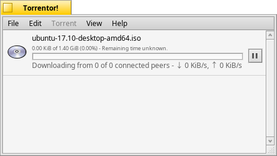

Torrentor!
=============
Torrentor is a torrent client for the Haiku operating system.



Requirements
-------
To build Torrentor you need some development libraries:

* OpenSSL   -- ```$ pkgman install devel:libssl```
* libevent  -- ```$ pkgman install devel:libevent```
* curl      -- ```$ pkgman install devel:libcurl```

Build
-------
Be sure you're using gcc5, you can set this by running ```$ setarch x86```.<br>
To build torrentor, browse to the root source directory and run ```$ jam```.
